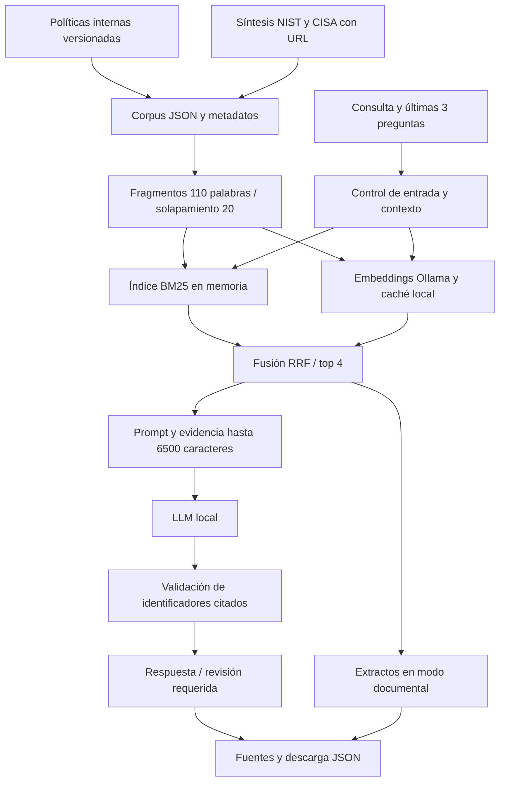

# Nexo Soporte

**Autora:** Daniela Peña · ISY0101

**Repositorio:** https://github.com/Danipez/Nexo-Soporte

Asistente de conocimiento para una mesa de ayuda de TI. Recupera procedimientos internos y referencias públicas, muestra el origen de cada fragmento y permite generar una respuesta mediante un LLM local.

## Caso y alcance

Servicios Andinos es una organización **contextualizada** de servicios profesionales, con 120 colaboradores y una mesa de ayuda de tres personas como supuestos de diseño. El problema abordado es la dispersión de instrucciones de acceso, VPN y seguridad. Las seis políticas internas se elaboraron para este escenario. Las dos referencias externas son síntesis identificadas de NIST y CISA, con enlaces a los originales.

Nexo orienta y recupera información. No cambia contraseñas, no concede permisos y no crea tickets. No contiene registros reales de trabajadores.

## Inicio rápido

Requisito: Python 3.11 o superior. No requiere instalar paquetes Python para ejecutar la aplicación.

```console
python -m nexo --serve
```

Abre http://127.0.0.1:8765. Selecciona **Consulta documental** para consultar los extractos de las fuentes. Detén el servidor con Ctrl+C.

También puedes consultar desde la terminal:

```console
python -m nexo "¿Cómo reporto un correo sospechoso de phishing?"
```

Ejecuta todos los comandos desde la carpeta que contiene este README.

## Generación con LLM y recuperación híbrida

1. Instala Ollama desde https://ollama.com y mantenlo activo.
2. Descarga los modelos. La descarga y los requisitos de memoria dependen del modelo y del equipo.

```console
ollama pull qwen3:4b
ollama pull embeddinggemma
python -m nexo "¿Cómo recupero mi acceso?" --mode llm
```

3. En la aplicación selecciona **Asistente LLM local**. La primera consulta genera y guarda embeddings en `.cache/embeddings.json`. Un cambio de corpus o de modelo invalida la caché.

Configuración opcional en PowerShell:

```powershell
$env:CHAT_MODEL = 'qwen3:4b'
$env:EMBED_MODEL = 'embeddinggemma'
$env:OLLAMA_URL = 'http://127.0.0.1:11434'
```

El archivo `.env.example` documenta las variables. La aplicación no carga archivos `.env`. Si Ollama no está disponible, informa el error y permite cambiar a consulta documental, sin presentar extractos como una respuesta generada.

## Flujo



## Validación reproducible

```console
python -m unittest discover -s tests -v
python scripts/evaluar.py
python scripts/evaluar.py --mode llm
```

La última instrucción requiere Ollama y escribe un archivo separado. La evaluación documental incluida obtuvo Recall@4 = 0,95, MRR = 1,00 y abstención correcta en 2 de 2 preguntas fuera de alcance. Son 10 preguntas con documentos esperados y 2 sin evidencia. No constituyen una estimación de desempeño en producción. La fidelidad semántica del LLM requiere revisar las afirmaciones contra las fuentes y **no se midió** en la ejecución incluida.

## Entregables

- `entregables/informe_tecnico.pdf`: informe de hasta cinco páginas.
- `entregables/presentacion.pptx`: apoyo visual para 10 minutos de exposición.
- `docs/propuesta.md`: propuesta para revisión previa del docente.
- `docs/defensa.md`: distribución de tiempo y preguntas de preparación.
- `docs/diseno.md`: especificación, prompts, límites y criterios de evaluación.
- `docs/matriz_pauta.md`: correspondencia entre IE1-IE9 y archivos.
- `evidencias/`: resultados verificables de recuperación y controles de software.
- `docs/cierre_entrega.md`: datos y revisiones que requieren participación del equipo.

## Estructura

`nexo/core.py` contiene fragmentación, BM25, embeddings, fusión y generación. `nexo/web.py` sirve una interfaz local. `data/corpus.json` contiene el conocimiento versionado. `data/consultas.json` declara las consultas y fuentes esperadas. `tests/` cubre controles relevantes y `scripts/evaluar.py` produce las métricas.

## Restricciones conocidas

- La validación de citas comprueba identificadores, no que cada afirmación sea verdadera. Una cita válida puede acompañar una inferencia incorrecta.
- El buscador léxico puede perder paráfrasis y recuperar coincidencias poco útiles. El umbral semántico de 0,45 necesita calibración con consultas reales.
- La memoria conserva sólo preguntas en la pestaña durante la sesión. La resolución de referencias es una heurística acotada.
- No hay autenticación, permisos por documento ni concurrencia para producción. El servidor escucha sólo en el equipo local y no debe exponerse a Internet.
- Las fuentes externas son síntesis revisadas, no una navegación web en vivo. Deben revisarse antes de actualizar el corpus.
- El modo LLM está implementado pero no se ejecutó en el entorno de preparación, que no dispone de Ollama.

## Referencia de origen

El diseño retoma los temas de fragmentación, embeddings y evaluación del material del curso [Ingeniería de Soluciones con Inteligencia Artificial](https://github.com/davila7/Ingenier-a-de-Soluciones-con-Inteligencia-Artificial), especialmente RA1/IL1.3 e IL1.4. La implementación de este repositorio es independiente y no copia los notebooks.
